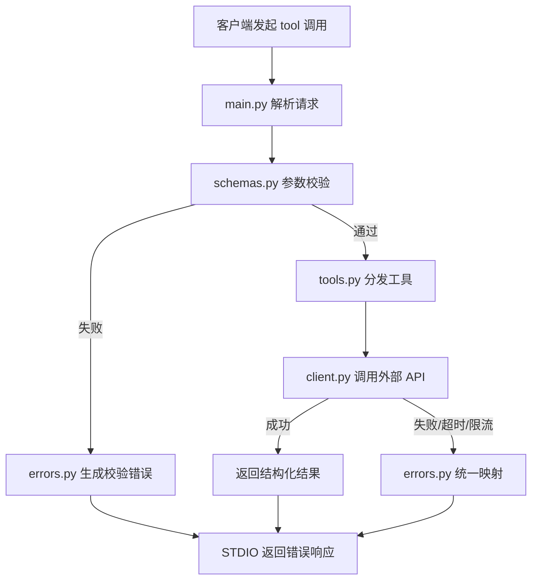

# Week 3 项目框架设计与工作计划（MCP Server）

## 1. 项目目标
- 在 `week3/` 内实现一个可运行的 MCP Server（优先 STDIO）。
- 基于真实外部 API 提供至少 2 个工具能力。
- 保障健壮性：输入校验、超时、限流提示、空结果处理、错误可解释。
- 提供可复现的文档，确保助教可按步骤完成验收。

## 2. 范围与边界
- **本阶段（当前）**：完成文档与代码脚手架，打通本地可运行骨架。
- **下一阶段**：接入真实外部 API 并完善错误分层与测试覆盖。
- **非目标**：本阶段不强制完成远程 HTTP 部署与 OAuth2（仅预留扩展点）。

## 3. 目录与职责
- `week3/README.md`：使用说明、客户端接入、工具清单。
- `week3/PROJECT_PLAN.md`：计划、里程碑、验收标准、风险矩阵。
- `week3/server/main.py`：STDIO 入口与请求分发。
- `week3/server/config.py`：环境变量与运行配置读取。
- `week3/server/errors.py`：统一错误类型与错误响应映射。
- `week3/server/schemas.py`：请求参数模型与校验规则。
- `week3/server/client.py`：外部 API 访问层（含 mock/真实模式扩展点）。
- `week3/server/tools.py`：工具注册与业务编排。
- `week3/tests/test_schemas.py`：参数校验单元测试。
- `week3/tests/test_tools.py`：工具层行为测试。

## 4. 分阶段里程碑
- M1：脚手架创建完成，`main.py` 可启动并处理基础请求。
- M2：2 个工具签名与参数校验稳定。
- M3：接入真实 API，覆盖超时/空结果/限流分支。
- M4：文档收敛，提供可复制的验收命令与示例调用。
- M5（可选加分）：HTTP 传输 + API Key/OAuth2。

## 5. 测试与验收标准
- **测试重点**
  - 参数校验：缺字段、类型错误、边界值。
  - 错误分支：未知工具、外部异常、解析失败。
  - 业务结果：工具输出字段稳定且可序列化。
- **验收标准**
  - 本地可运行：能通过 STDIO 调用两个工具。
  - 错误可解释：返回结构化错误，不吞异常。
  - 文档可复现：按 README 指令可完成启动与调用。

## 6. 风险与防御策略
- API 限流：通过错误码映射为用户可读提示，避免无限重试。
- 网络波动：请求必须配置超时，防止阻塞调用链。
- 输入污染：全部入口参数采用模型校验，拒绝脏数据。
- 机密泄漏：日志不输出 token/key；STDIO 仅输出协议结果。

## 7. 处理流程图

## 8. 当前状态
- [x] 规划完成
- [x] 文档骨架完成
- [x] 代码脚手架完成
- [x] 基础测试文件创建
- [x] 真实 API 接入与增强测试
- [x] Codex/Copilot 客户端配置模板与联通指引
- [x] 最小 MCP JSON-RPC 入口（initialize/tools/list/tools/call/ping）
