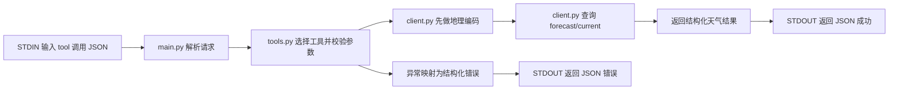

# Week 3 MCP Server（Open-Meteo）

本目录已接入 Open-Meteo 真实天气 API（默认仍可使用 mock 模式）。

## 1. 当前能力
- 提供两个工具入口：
  - `get_current_weather`
  - `get_forecast`
- 已实现：参数校验、统一错误响应、STDIO 请求分发、真实 API 调用、重试与超时处理。

## 2. 目录结构
```text
week3/
  README.md
  PROJECT_PLAN.md
  server/
    __init__.py
    main.py
    config.py
    errors.py
    schemas.py
    client.py
    tools.py
  tests/
    __init__.py
    test_client.py
    test_schemas.py
    test_tools.py
```

## 3. 环境变量
Open-Meteo 免费接口默认不需要 API Key。

- `USE_MOCK_API`：`true/false`，默认 `true`
- `WEATHER_BASE_URL`：默认 `https://api.open-meteo.com/v1`
- `GEOCODING_BASE_URL`：默认 `https://geocoding-api.open-meteo.com/v1`
- `REQUEST_TIMEOUT_SECONDS`：默认 `8`
- `MAX_RETRIES`：默认 `2`
- `RETRY_BACKOFF_SECONDS`：默认 `0.4`

## 4. 运行方式（本地 STDIO）
在仓库根目录执行：

```powershell
python -m week3.server.main
```

输入一行 JSON 作为请求，例如：

```json
{"tool": "get_current_weather", "arguments": {"city": "Shanghai"}}
```

返回一行 JSON 结果。

示例（查询 3 天预报）：

```json
{"tool": "get_forecast", "arguments": {"city": "Shanghai", "days": 3}}
```

若要启用真实 API：

```powershell
$env:USE_MOCK_API="false"
python -m week3.server.main
```

面向 Codex/Copilot 的 MCP 客户端，建议使用 MCP 入口：

```powershell
python -m week3.server.mcp_stdio
```

## 5. 快速测试
在仓库根目录执行：

```powershell
pytest week3/tests -q
```

## 6. 调用流程


## 7. Codex / GitHub Copilot 客户端配置（本地 STDIO）

> 兼容性说明：不同版本客户端的配置字段可能有差异（如 `mcpServers` vs `mcp_servers`）。
> 以下示例提供最小语义映射：`command + args + env`，请以你当前客户端官方 schema 为准。

审阅版完整文档：`week3/docs/MCP_CLIENT_CONFIG_REVIEW.md`

### 7.1 GitHub Copilot（JSON 风格模板）
可放在工作区级 MCP 配置文件中（路径以你的 IDE 版本为准）：

```json
{
  "mcpServers": {
    "week3-weather": {
      "command": "python",
      "args": ["-m", "week3.server.mcp_stdio"],
      "env": {
        "USE_MOCK_API": "false",
        "REQUEST_TIMEOUT_SECONDS": "8",
        "MAX_RETRIES": "2",
        "RETRY_BACKOFF_SECONDS": "0.4"
      }
    }
  }
}
```

### 7.2 Codex（TOML 风格模板）
可放在 Codex 客户端配置中（文件路径以本机安装版本为准）：

```toml
[mcp_servers.week3_weather]
command = "python"
args = ["-m", "week3.server.mcp_stdio"]
cwd = "D:\\code\\Python\\CS146S"
env = { USE_MOCK_API = "false", REQUEST_TIMEOUT_SECONDS = "8", MAX_RETRIES = "2", RETRY_BACKOFF_SECONDS = "0.4" }
```

### 7.3 联通验证清单
1. 客户端能成功拉起 `week3-weather` 进程（无崩溃）。
2. 工具列表能看到 `get_current_weather`、`get_forecast`。
3. 触发一次工具调用并返回结构化 JSON。

示例输入：

```json
{"tool":"get_current_weather","arguments":{"city":"Shanghai"}}
```

### 7.4 当前限制
- `week3/server/main.py` 是课程作业调试入口（逐行 JSON 请求/响应）。
- `week3/server/mcp_stdio.py` 提供最小 MCP JSON-RPC 流程（initialize/tools/list/tools/call/ping）。
